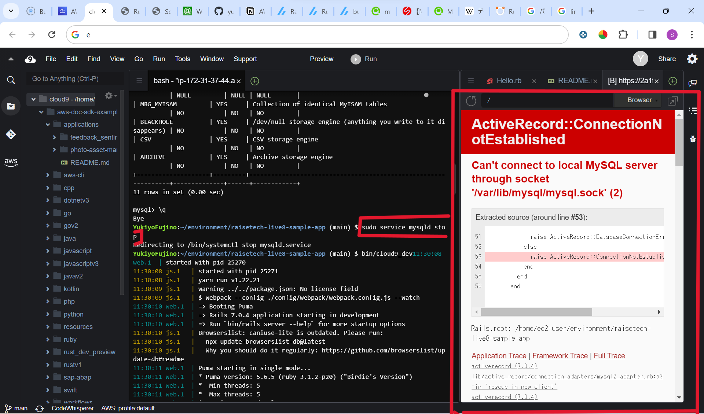

# 第3回課題
### 1.APサーバーについて
+ APサーバーの名前とバージョン

+ APサーバー終了時アクセスの可否

### 2.DBサーバーについて
+ DBサーバー名

+ DBサーバーバージョン

+ DBサーバー終了時

+ Rails構成管理ツール

+ 追加分：アプリケーション画面スクリーンショット

## 学んだこと
見よう見まねでデプロイ作業に取り組んだが、一通り作業を完了させると
全体像がみえてきて、理解が進んだと感じられました。手を動かしてみるのが大事だと思いました。
